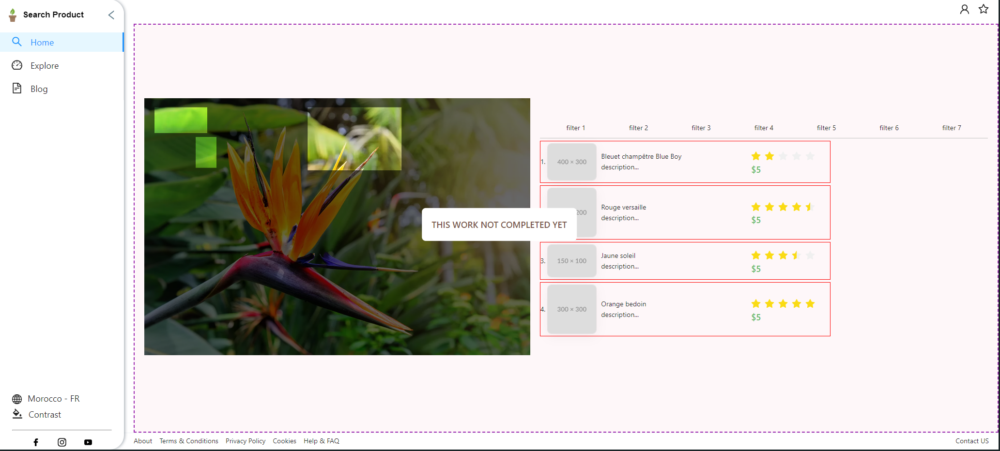
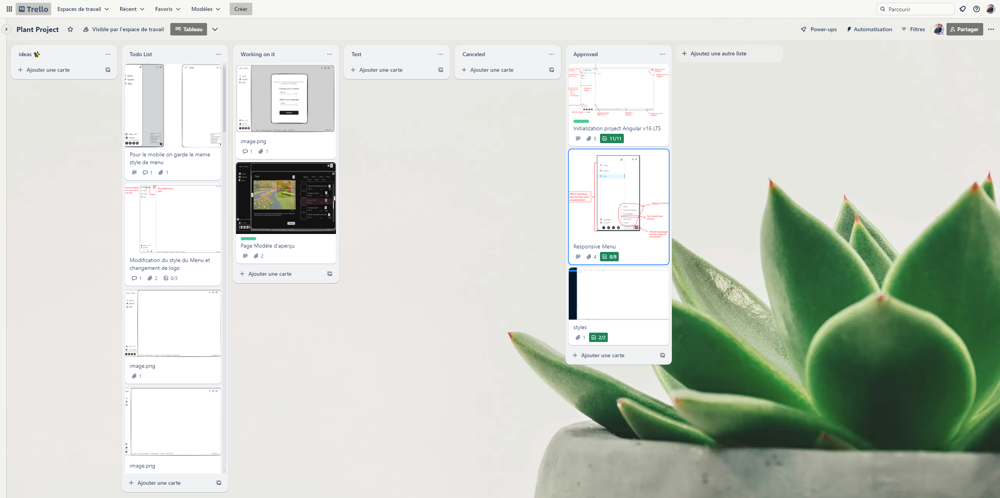

# SearchProduct

This project was generated with [Angular CLI](https://github.com/angular/angular-cli) version 16.2.12.

## Project information

Here are some additional details about the project:

* The project is built using Angular version 16.2.12.
* Node.js version 20.9.0
* NPM version 10.1.0
* ng-zorro-antd version 16.2.2

## Run Project
* npm start
## Build Project
* ng build

Note: To get the Node.js version, you can run `node --version` in the terminal. To get the Angular version, you can run `ng --version` in the terminal.

Here are the contents of the `package.json` file:

## Trello

[Trello Link](https://trello.com/b/2ulu707Q/plant-project)

"# plant-project" 
